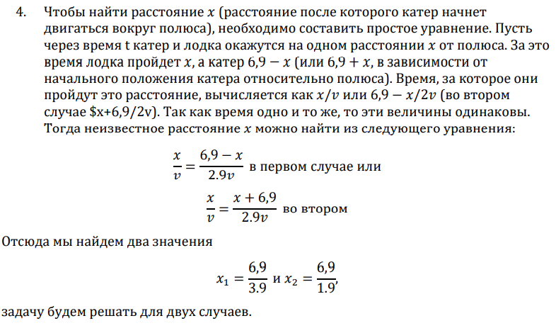
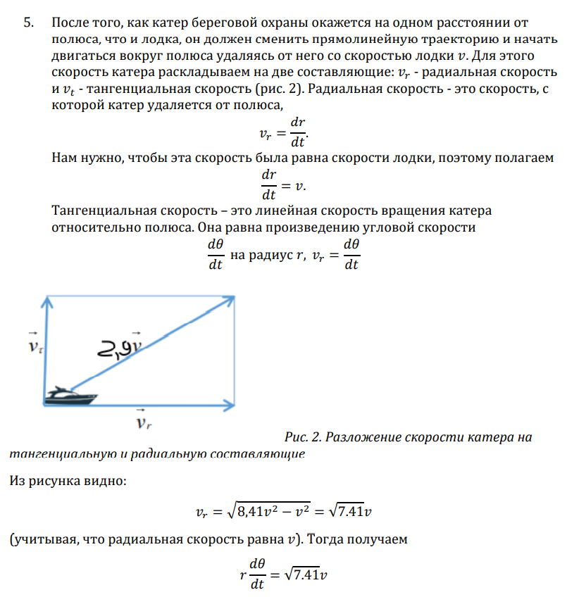
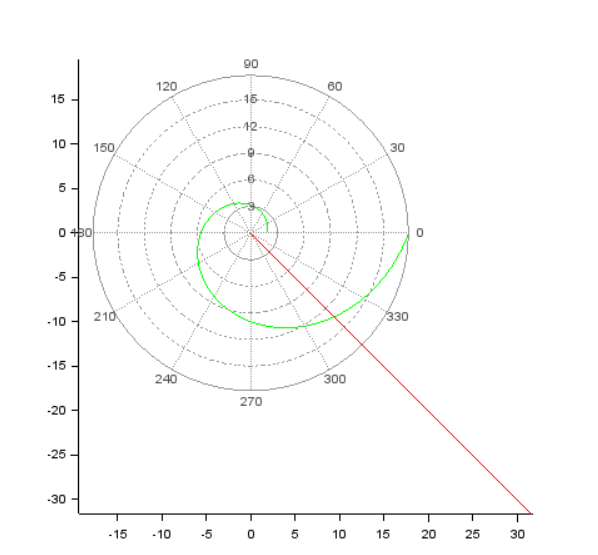
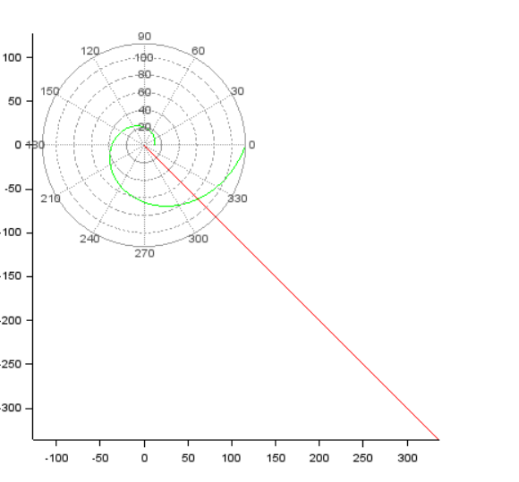

# Задача о погоне

###### ФИО: Жукова Виктория Юрьевна
###### Группа: НКНбд-01-19  
###### Студ. билет: 1032196000

---

# Прагматика
Для решения задачи о погоне

# Цель
Научиться моделировать тракекторию движения и строить по ней графики

---

# Задачи
1. Записать уравнение, описывающее движение катера, с начальными
условиями для двух случаев (в зависимости от расположения катера
относительно лодки в начальный момент времени).
2. Построить траекторию движения катера и лодки для двух случаев.
3. Найти точку пересечения траектории катера и лодки.

---

# Результаты

---

# Выведена формула

---

# Выведена формула

---

# Построена траектория и найдена точка

*График 1*

---

# Построена траектория и найдена точка

*График 2*

---

# Итоги

1. Записала уравнение, описывающее движение катера, с начальными
условиями для двух случаев (в зависимости от расположения катера
относительно лодки в начальный момент времени).
2. Построила траекторию движения катера и лодки для двух случаев.
3. Нашла точку пересечения траектории катера и лодки. 
4. Научилась моделировать траекторию с помощью scilab.

###### Спасибо за внимание
