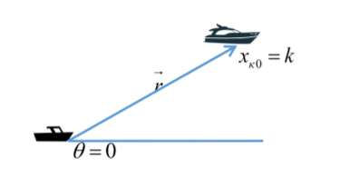
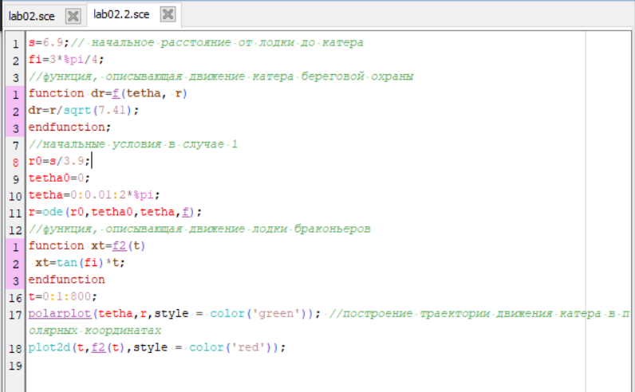
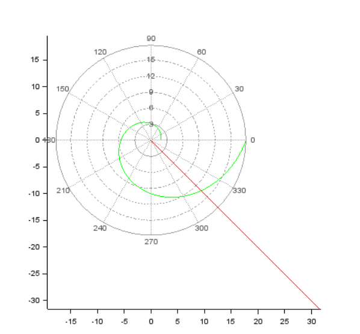
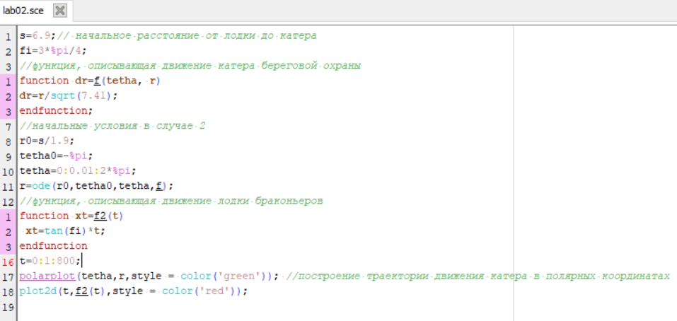
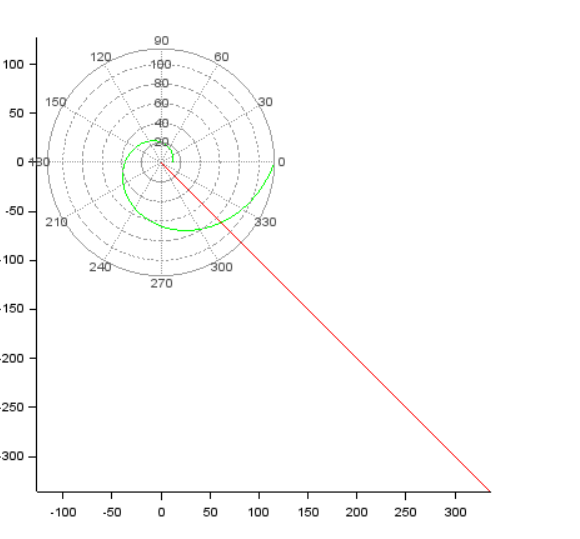

---
# Front matter
title: "Отчёт по лабораторной работе №2"
subtitle: "Задача о погоне"
author: "Жукова Виктория Юрьевна"

# Generic otions
lang: ru-RU
toc-title: "Содержание"

# Bibliography
bibliography: bib/cite.bib
csl: pandoc/csl/gost-r-7-0-5-2008-numeric.csl

# Pdf output format
toc: true # Table of contents
toc_depth: 2
lof: true # List of figures
lot: true # List of tables
fontsize: 12pt
linestretch: 1.5
papersize: a4
documentclass: scrreprt
## I18n
polyglossia-lang:
  name: russian
  options:
	- spelling=modern
	- babelshorthands=true
polyglossia-otherlangs:
  name: english
### Fonts
mainfont: PT Serif
romanfont: PT Serif
sansfont: PT Sans
monofont: PT Mono
mainfontoptions: Ligatures=TeX
romanfontoptions: Ligatures=TeX
sansfontoptions: Ligatures=TeX,Scale=MatchLowercase
monofontoptions: Scale=MatchLowercase,Scale=0.9
## Biblatex
biblatex: true
biblio-style: "gost-numeric"
biblatexoptions:
  - parentracker=true
  - backend=biber
  - hyperref=auto
  - language=auto
  - autolang=other*
  - citestyle=gost-numeric
## Misc options
indent: true
header-includes:
  - \linepenalty=10 # the penalty added to the badness of each line within a paragraph (no associated penalty node) Increasing the value makes tex try to have fewer lines in the paragraph.
  - \interlinepenalty=0 # value of the penalty (node) added after each line of a paragraph.
  - \hyphenpenalty=50 # the penalty for line breaking at an automatically inserted hyphen
  - \exhyphenpenalty=50 # the penalty for line breaking at an explicit hyphen
  - \binoppenalty=700 # the penalty for breaking a line at a binary operator
  - \relpenalty=500 # the penalty for breaking a line at a relation
  - \clubpenalty=150 # extra penalty for breaking after first line of a paragraph
  - \widowpenalty=150 # extra penalty for breaking before last line of a paragraph
  - \displaywidowpenalty=50 # extra penalty for breaking before last line before a display math
  - \brokenpenalty=100 # extra penalty for page breaking after a hyphenated line
  - \predisplaypenalty=10000 # penalty for breaking before a display
  - \postdisplaypenalty=0 # penalty for breaking after a display
  - \floatingpenalty = 20000 # penalty for splitting an insertion (can only be split footnote in standard LaTeX)
  - \raggedbottom # or \flushbottom
  - \usepackage{float} # keep figures where there are in the text
  - \floatplacement{figure}{H} # keep figures where there are in the text
---

# Цель работы

Цель данной работы состоит в том, чтобы научиться моделировать тракекторию движения и строить по ней графики.

# Задание
(Вариант 11)

На море в тумане катер береговой охраны преследует лодку браконьеров.
Через определенный промежуток времени туман рассеивается, и лодка
обнаруживается на расстоянии 6,9 км от катера. Затем лодка снова скрывается в
тумане и уходит прямолинейно в неизвестном направлении. Известно, что скорость
катера в 2,9 раза больше скорости браконьерской лодки.

1. Запишите уравнение, описывающее движение катера, с начальными
условиями для двух случаев (в зависимости от расположения катера
относительно лодки в начальный момент времени).
2. Постройте траекторию движения катера и лодки для двух случаев.
3. Найдите точку пересечения траектории катера и лодки 

# Постановка задачи
1. Принимаем за $t_0 = 0$, $x_{л0} = 0$ - место нахождения лодки браконьеров в момент обнаружения, $x_{к0} = 6,9$ - место нахождения катера береговой охраны
относительно лодки браконьеров в момент обнаружения лодки.

2. Введем полярные координаты. Считаем, что полюс - это точка обнаружения
лодки браконьеров $x_{л0}$ ($\theta = x_{л0} = 0$), а полярная ось r проходит через точку нахождения катера береговой охраны (рис. 1)

*Рис. 1. Положение катера и лодки в начальный момент времени*

3. Траектория катера должна быть такой, чтобы и катер, и лодка все время
были на одном расстоянии от полюса $\theta$, только в этом случае траектория катера пересечется с траекторией лодки.
Поэтому для начала катер береговой охраны должен двигаться некоторое
время прямолинейно, пока не окажется на том же расстоянии от полюса, что и лодка браконьеров. После этого катер береговой охраны должен двигаться вокруг полюса удаляясь от него с той же скоростью, что и лодка
браконьеров.

4. Чтобы найти расстояние $x$ (расстояние после которого катер начнет двигаться вокруг полюса), необходимо составить простое уравнение. Пусть через время t катер и лодка окажутся на одном расстоянии $x$ от полюса. За это время лодка пройдет $x$, а катер $6,9-x$ (или
$6,9+x$, в зависимости от начального положения катера относительно полюса). Время, за которое они пройдут это расстояние, вычисляется как
$x/v$ или $6,9-x/2v$ (во втором случае $x+6,9/2v). Так как время одно и то же, то эти величины одинаковы.
Тогда неизвестное расстояние $x$ можно найти из следующего уравнения:

$$ \frac{x}{v} = \frac{6,9-x}{2.9v}\ в\ первом \ случае \ или$$

$$ \frac{x}{v} = \frac{x+6,9}{2.9v}\ во\ втором$$
Отсюда мы найдем два значения $$x_1 = \frac{6,9}{3.9} \ и \ x_2 = \frac{6,9}{1.9},$$ задачу будем решать для
двух случаев.

5. После того, как катер береговой охраны окажется на одном расстоянии от полюса, что и лодка, он должен сменить прямолинейную траекторию и
начать двигаться вокруг полюса удаляясь от него со скоростью лодки $v$.
Для этого скорость катера раскладываем на две составляющие:
$v_r$ -  радиальная скорость и $v_t$ - тангенциальная скорость (рис. 2). Радиальная
скорость - это скорость, с которой катер удаляется от полюса,
$$v_r = \frac{dr}{dt}.$$
Нам нужно, чтобы эта скорость была равна скорости лодки, поэтому полагаем
$$\frac{dr}{dt}=v.$$
Тангенциальная скорость – это линейная скорость вращения катера относительно полюса. Она равна произведению угловой скорости
$$\frac{d\theta}{dt} \ на \ 
радиус \ r, \ v_r = \frac{d\theta}{dt}$$ 

*Рис. 2. Разложение скорости катера на тангенциальную и радиальную
составляющие*

Из рисунка видно:
$$v_r=\sqrt{8,41v^2-v^2}=\sqrt{7.41}v$$
(учитывая, что радиальная
скорость равна $v$). Тогда получаем $$r\frac{d\theta}{dt}=\sqrt{7.41}v$$

6. Решение исходной задачи сводится к решению системы из двух дифференциальных уравнений
$$\begin{equation*} 
  \begin{cases} 
    \frac{\partial r}{\partial t} = v 
    \\
    r \frac{\partial \theta}{\partial t} = \sqrt{7.41}v 
  \end{cases}
\end{equation*} 

с \ начальными \ условиями 

\begin{equation*}
  \begin{cases}
    \theta_0 = 0 
    \\ 
    r_0 = x_1 
  \end{cases}
\end{equation*}
или
\begin{equation*}
  \begin{cases}
    \theta_0 = -\pi
    \\
    r_0 = x_2
  \end{cases}
\end{equation*} $$

Исключая из полученной системы производную по $t$, можно перейти к следующему уравнению:

$$\frac{dr}{d\theta}=\frac{r}{\sqrt{7.41}}.$$
Начальные условия остаются прежними. Решив это уравнение, мы получим траекторию движения катера в полярных координатах.

# Построение
Для первого случая 
- Код в Scilb (рис. 3)
 *Рис. 3. Код программы для моделирования случая 1*
- Траектория (рис. 4)
 *Рис. 4. График траектории для случая 1*

Для второго случая 
- Код в Scilb (рис. 5)
 *Рис. 5. Код программы для моделирования случая 1*
- Траектория (рис. 6)
 *Рис. 6. График траектории для случая 2*

# Выводы

1. Записала уравнение, описывающее движение катера, с начальными
условиями для двух случаев (в зависимости от расположения катера
относительно лодки в начальный момент времени).
2. Построила траекторию движения катера и лодки для двух случаев.
3. Нашла точку пересечения траектории катера и лодки. 
4. Научилась моделировать траекторию с помощью scilab.

# Библиография

1. [Методичка по задаче о погоне. Кулябов Д.С.](https://esystem.rudn.ru/pluginfile.php/1343800/mod_resource/content/2/%D0%9B%D0%B0%D0%B1%D0%BE%D1%80%D0%B0%D1%82%D0%BE%D1%80%D0%BD%D0%B0%D1%8F%20%D1%80%D0%B0%D0%B1%D0%BE%D1%82%D0%B0%20%E2%84%96%201.pdf) 
2. [Fomulars in Markdown. Archer Reilly](https://csrgxtu.github.io/2015/03/20/Writing-Mathematic-Fomulars-in-Markdown/)