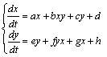
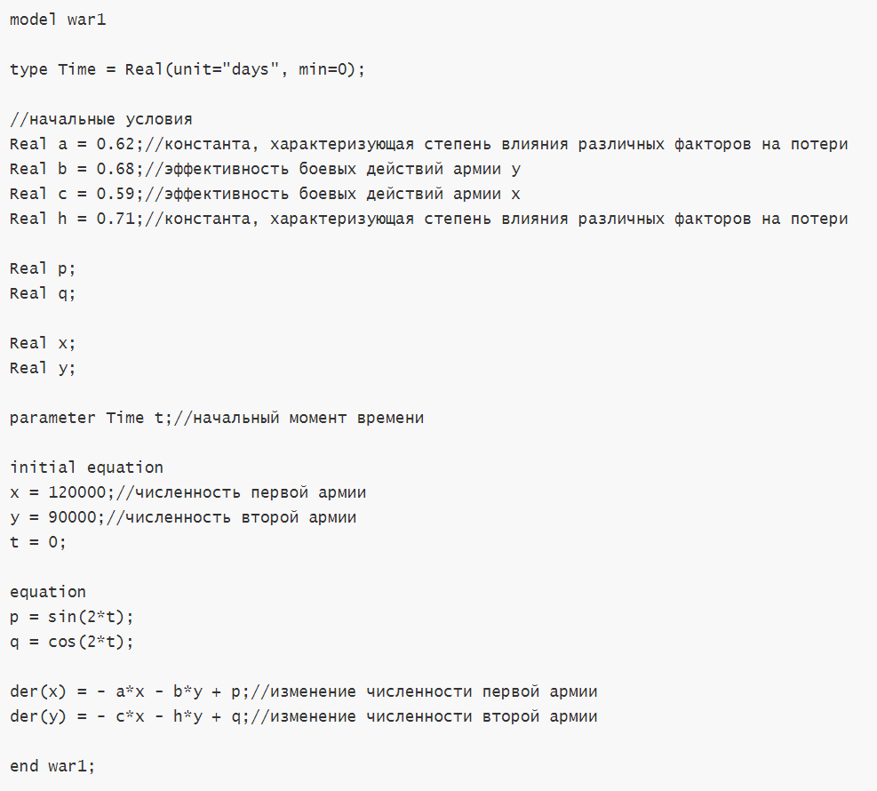
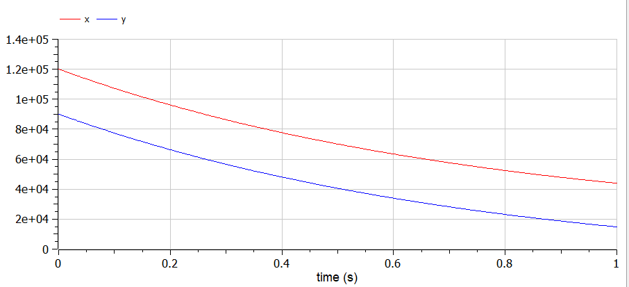
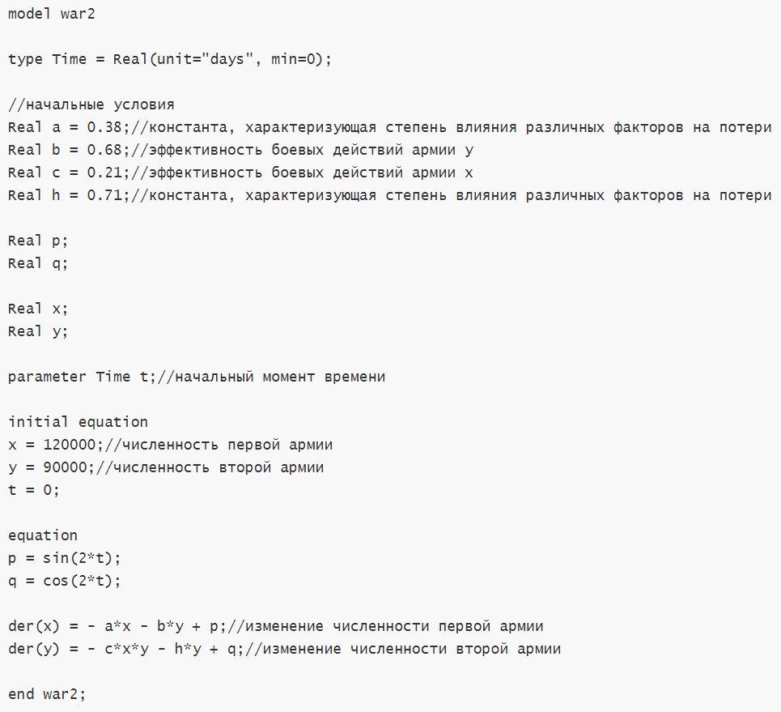
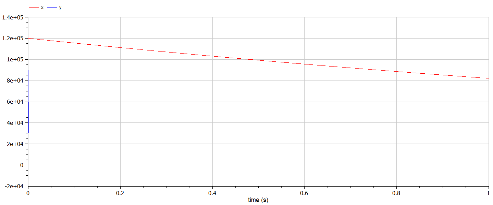

# Моделирование боевых действий

###### ФИО: Жукова Виктория Юрьевна
###### Группа: НКНбд-01-19  
###### Студ. билет: 1032196000

---

# Прагматика
Для моделирования военных действий

# Цель
Рассмотреть простейшие модели боевых действий – модели
Ланчестера и научиться их строить

---

# Задачи
Построить модели для боевых действий
1. С регулярной армией
2. С регулярной армией и партизанскими отрядами

---

# Теоретическое введение

---

# История

В 1916 году английский математик Фредерик Уильям Ланчестер предложил систему из двух однородных дифференциальных уравнений для моделирования воздушного боя. Область их применения за почти сто лет также заметно расширилась: от описания взаимодействия этносов, проживающих на одной территории, до модели конкурентного взаимодействия двух фирм.

---

# Математика

В наиболее общем виде ланчестерские модели можно описать уравнением:

---

# Результаты

---

- Программа для случая с регулярными войсками

---

- График для случая с регулярными войсками

---

- Программа для случая с регулярными войсками и партизанскими отрядами

---

- График для случая с регулярными войсками и партизанскими отрядами

---

# Итоги
1. Познакомилась с моделью боевых действий от Ланчестера.
2. Рассмотрела два случая ведения боевых действий: между регулярными войсками, с участием регулярных войск и партизанских.
3. Построила графики изменения численности войск армии для этих случаев.
4. Познакомилась с openModelica на практике.

##### Спасибо за внимание

