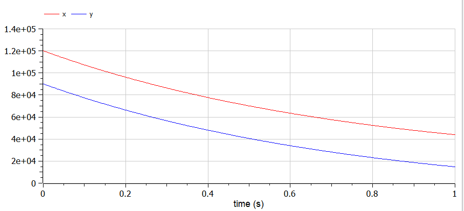
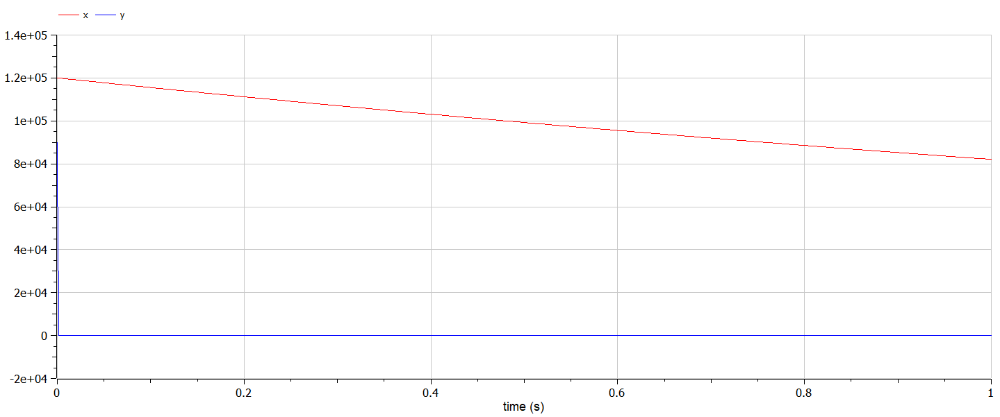

---
# Front matter
title: "Отчёт по лабораторной работе №3"
subtitle: "Модель боевых действий"
author: "Жукова Виктория Юрьевна"

# Generic otions
lang: ru-RU
toc-title: "Содержание"

# Bibliography
bibliography: bib/cite.bib
csl: pandoc/csl/gost-r-7-0-5-2008-numeric.csl
# Formatting
toc-title: "Содержание"
toc: true # Table of contents
toc_depth: 2
lof: true # List of figures
lot: true # List of tables
fontsize: 12pt
linestretch: 1.5
papersize: a4paper
documentclass: scrreprt
polyglossia-lang: russian
polyglossia-otherlangs: english
mainfont: PT Serif
romanfont: PT Serif
sansfont: PT Sans
monofont: PT Mono
mainfontoptions: Ligatures=TeX
romanfontoptions: Ligatures=TeX
sansfontoptions: Ligatures=TeX,Scale=MatchLowercase
monofontoptions: Scale=MatchLowercase
indent: true
pdf-engine: lualatex
header-includes:
  - \usepackage[russian]{babel}
  - \linepenalty=10 # the penalty added to the badness of each line within a paragraph (no associated penalty node) Increasing the value makes tex try to have fewer lines in the paragraph.
  - \interlinepenalty=0 # value of the penalty (node) added after each line of a paragraph.
  - \hyphenpenalty=50 # the penalty for line breaking at an automatically inserted hyphen
  - \exhyphenpenalty=50 # the penalty for line breaking at an explicit hyphen
  - \binoppenalty=700 # the penalty for breaking a line at a binary operator
  - \relpenalty=500 # the penalty for breaking a line at a relation
  - \clubpenalty=150 # extra penalty for breaking after first line of a paragraph
  - \widowpenalty=150 # extra penalty for breaking before last line of a paragraph
  - \displaywidowpenalty=50 # extra penalty for breaking before last line before a display math
  - \brokenpenalty=100 # extra penalty for page breaking after a hyphenated line
  - \predisplaypenalty=10000 # penalty for breaking before a display
  - \postdisplaypenalty=0 # penalty for breaking after a display
  - \floatingpenalty = 20000 # penalty for splitting an insertion (can only be split footnote in standard LaTeX)
  - \raggedbottom # or \flushbottom
  - \usepackage{float} # keep figures where there are in the text
  - \floatplacement{figure}{H} # keep figures where there are in the text
---

# Цель работы
Цель данной работы состоит в том, чтобы рассмотреть простейшие модели боевых действий – модели
Ланчестера и научиться моделировать боевые действия.

# Задание
(Вариант 11)

Между страной Х и страной У идет война. Численность состава войск
исчисляется от начала войны, и являются временными функциями $x(t)$
и $y(t)$. В начальный момент времени страна Х имеет армию численностью 120 000 человек, а в распоряжении страны У армия численностью в 90 000 человек. Для упрощения модели считаем, что коэффициенты
$a, b, c, h$ постоянны. Также считаем $P(t)$ и $Q(t)$ непрерывные функции.
Постройте графики изменения численности войск армии Х и армии У для
следующих случаев:

1. Модель боевых действий между регулярными войсками
$$\frac{dx}{dt}=-0,62x(t)-0,68y(t)+\sin(2t)$$
$$\frac{dy}{dt}=-0,59x(t)-0,71y(t)+\cos(2t)$$
2. Модель ведение боевых действий с участием регулярных войск и
партизанских отрядов
$$\frac{dx}{dt}=-0,38x(t)-0,68y(t)+\sin(2t)$$
$$\frac{dy}{dt}=-0,21x(t)y(t)-0,71y(t)+\cos(2t)$$

# Теоретическое введение
Для определения жертв войн, действительных или потенциальных, наибольшее значение имеют следующие четыре модели.

1. Модель собственно Ланчестера (имеются только коэффициенты b и f). В этом случае количество жертв пропорционально количеству встреч между индивидуумами противоборствующих сторон (произведение численности сторон: x × y). Наиболее актуально подобное взаимодействие тогда, когда две стороны располагаются на общей территории (партизанская война, репрессии, вражда двух этносов и т. д.).

2. Модель Осипова (коэффициенты a и e). Количество жертв пропорционально численности противоположной стороны. Это может быть классическое военное взаимодействие, когда две стороны контактируют лишь на переднем крае.

3. Модель Петерсона (коэффициенты a и e). Количество жертв определяется численностью своей стороны. Это может быть моделью холодной войны, когда чем больше своих подводных лодок несут боевое дежурство, тем больше их гибнет.

4. Модель Брекни (коэффициенты a и f либо b и e). Жертвы одной стороны пропорциональны количеству встреч, а другой – численности ее противника. Модель была создана под впечатлением боевых действий во Вьетнаме и довольно удовлетворительно описывает конфликт, в котором одна из сторон ведет классическую войну, а вторая – партизанскую.

Рассмотрим некоторые простейшие модели боевых действий – модели
Ланчестера. В противоборстве могут принимать участие как регулярные войска,
так и партизанские отряды. В общем случае главной характеристикой соперников являются численности сторон. Если в какой-то момент времени одна из численностей обращается в нуль, то данная сторона считается проигравшей (при условии, что численность другой стороны в данный момент положительна).

Рассмотри два случая ведения боевых действий:
1. Боевые действия между регулярными войсками
2. Боевые действия с участием регулярных войск и партизанских
отрядов
В первом случае численность регулярных войск определяется тремя
факторами:
- скорость уменьшения численности войск из-за причин, не связанных с
боевыми действиями (болезни, травмы, дезертирство);
- скорость потерь, обусловленных боевыми действиями
противоборствующих сторон (что связанно с качеством стратегии,
уровнем вооружения, профессионализмом солдат и т.п.);
- скорость поступления подкрепления (задаётся некоторой функцией от
времени).

Во втором случае в борьбу добавляются партизанские отряды. Нерегулярные
войска в отличии от постоянной армии менее уязвимы, так как действуют скрытно,
в этом случае сопернику приходится действовать неизбирательно, по площадям,
занимаемым партизанами. Поэтому считается, что тем потерь партизан,
проводящих свои операции в разных местах на некоторой известной территории,
пропорционален не только численности армейских соединений, но и численности
самих партизан.
 
# Решение
1. Случай первый, когда война веедется между регулярными войсками 

- Программный код 
  
  ```

    model war1

    type Time = Real(unit="days", min=0);

    //начальные условия
    Real a = 0.62;//константа, характеризующая степень влияния различных факторов на потери
    Real b = 0.68;//эффективность боевых действий армии у
    Real c = 0.59;//эффективность боевых действий армии х
    Real h = 0.71;//константа, характеризующая степень влияния различных факторов на потери

    Real p;
    Real q;

    Real x;
    Real y;

    parameter Time t;//начальный момент времени

    initial equation
    x = 120000;//численность первой армии
    y = 90000;//численность второй армии
    t = 0;

    equation
    p = sin(2*t);
    q = cos(2*t);

    der(x) = - a*x - b*y + p;//изменение численности первой армии
    der(y) = - c*x - h*y + q;//изменение численности второй армии

    end war1;

  ```
    
- График для случая с регулярными войсками (рис. 1)

  
  *Рис. 1. График для случая с регулярными войсками*

2. Случай второй, когда война ведется между регулярными войсками с участием партизанских отрядов (рис. 2)

- Программный код 
  
  ```
    model war2

    type Time = Real(unit="days", min=0);

    //начальные условия
    Real a = 0.38;//константа, характеризующая степень влияния различных факторов на потери
    Real b = 0.68;//эффективность боевых действий армии у
    Real c = 0.21;//эффективность боевых действий армии х
    Real h = 0.71;//константа, характеризующая степень влияния различных факторов на потери

    Real p;
    Real q;

    Real x;
    Real y;

    parameter Time t;//начальный момент времени

    initial equation
    x = 120000;//численность первой армии
    y = 90000;//численность второй армии
    t = 0;

    equation
    p = sin(2*t);
    q = cos(2*t);

    der(x) = - a*x - b*y + p;//изменение численности первой армии
    der(y) = - c*x*y - h*y + q;//изменение численности второй армии

    end war2;

    ```
- График для случая с регулярными войсками и партизанскими отрядами (рис. 2)

  
  *Рис. 2. График для случая с регулярными войсками и партизанскими отрядами*

# Выводы
1. Познакомилась с моделью боевых действий от Ланчестера.
2. Рассмотрела два случая ведения боевых действий: между регулярными войсками, с участием регулярных войск и партизанских.
3. Построила графики изменения численности войск армии для этих случаев.
4. Познакомилась с openModelica на практике.

# Библиография
1. [Методичка по моделированию боевых действий. Кулябов Д.С.](https://esystem.rudn.ru/pluginfile.php/1343805/mod_resource/content/2/%D0%9B%D0%B0%D0%B1%D0%BE%D1%80%D0%B0%D1%82%D0%BE%D1%80%D0%BD%D0%B0%D1%8F%20%D1%80%D0%B0%D0%B1%D0%BE%D1%82%D0%B0%20%E2%84%96%202.pdf) 
2. [Fomulars in Markdown. Archer Reilly](https://csrgxtu.github.io/2015/03/20/Writing-Mathematic-Fomulars-in-Markdown/)
3. [Определение жертв войн через ланчестерские модели](https://www.socionauki.ru/journal/articles/130365/)