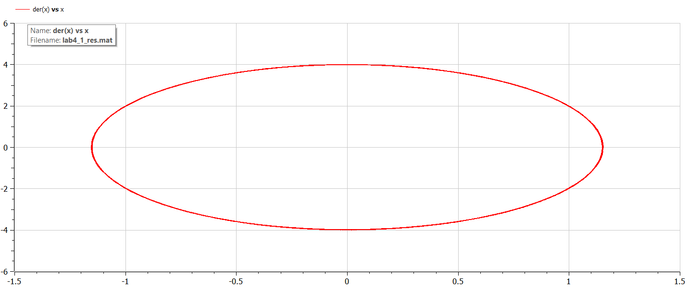
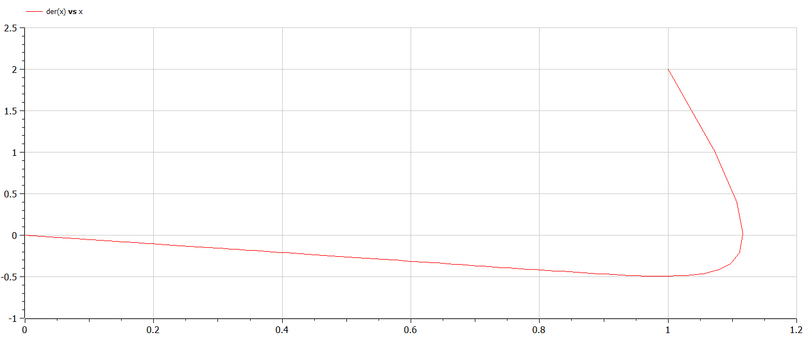
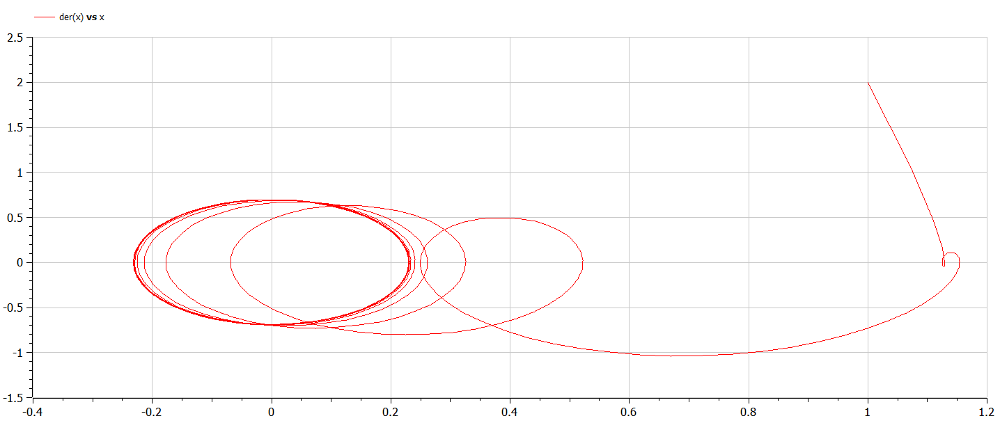

# Модель гармонических колебаний

###### ФИО: Жукова Виктория Юрьевна
###### Группа: НКНбд-01-19  
###### Студ. билет: 1032196000

---

# Прагматика
Для моделирования гармонических колебаний

# Цель
Рассмотреть модель гармонических колебаний, сделать программу для получения графиков линейного гармонического осциллятора.

---

# Задачи
Построить модели для случаев
- Колебания гармонического осциллятора без затуханий и без действий внешней
силы
- Колебания гармонического осциллятора c затуханием и без действий внешней
силы
- Колебания гармонического осциллятора c затуханием и под действием внешней
силы

---

# Теоретическое введение

Движение грузика на пружинке, маятника, заряда в электрическом контуре, а
также эволюция во времени многих систем в физике, химии, биологии и других
науках при определенных предположениях можно описать одним и тем же
дифференциальным уравнением, которое в теории колебаний выступает в качестве
основной модели. Эта модель называется линейным гармоническим осциллятором.

---

# Уравнение

Уравнение свободных колебаний гармонического осциллятора имеет следующий вид:
$$ \ddot {x} + 2 \gamma \dot {x} + w_0^2x = f(t) $$

$x$ — переменная, описывающая состояние системы (смещение грузика, заряд конденсатора и т.д.)

$t$ — время

$w$ — частота

$\gamma$ — затухание

---

# Результаты. Случай 1
## Код
```
model lab4_1

constant Real w=sqrt(12);
  
Real x;
Real y;
  
initial equation
  x=1;
  y=2;

equation
  der(x)=y;
  der(y)=-w*w*x;

end lab4_1;
```
---
# Результаты. Случай 1
## График



---

# Результаты. Случай 2
## Код
```
model lab4_2
  
constant Real w=sqrt(5);
constant Real g=10;
  
Real x;
Real y;
  
initial equation
  x=1;
  y=2;

equation
  der(x)=y;
  der(y)=-g*y-w*w*x;

end lab4_2;
```
---
# Результаты. Случай 2
## График



---

# Результаты. Случай 3
## Код
```
model lab4_3
  
constant Real w=sqrt(5);
constant Real g=10;
  
Real x;
Real y;
Real f;
  
initial equation
  x=1;
  y=2;
  f=0;

equation
  f=7*sin(3*time);
  der(x)=y;
  der(y)=-g*y-w*w*x+f;

end lab4_3;
```
---
# Результаты. Случай 3
## График



---
# Выводы
1. Изучила модель гармонического осциллятора.
2. Построила фазовый портрет гармонического осциллятора и решила уравнения
гармонического осциллятора для случаев:
- Колебания гармонического осциллятора без затуханий и без действий внешней
силы
- Колебания гармонического осциллятора c затуханием и без действий внешней
силы
- Колебания гармонического осциллятора c затуханием и под действием внешней
силы
3. Научилась строить графики в openModelica с заданным интервалом и шагом.