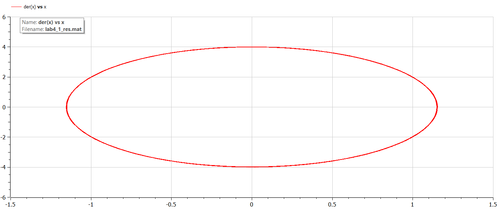
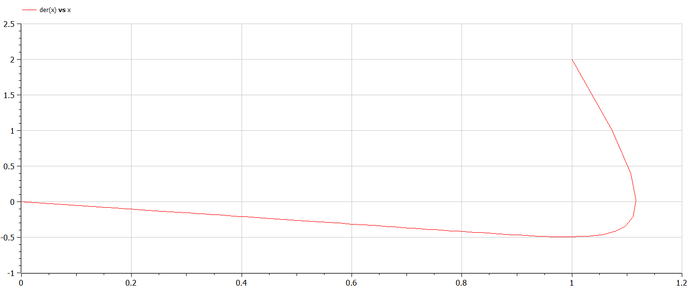
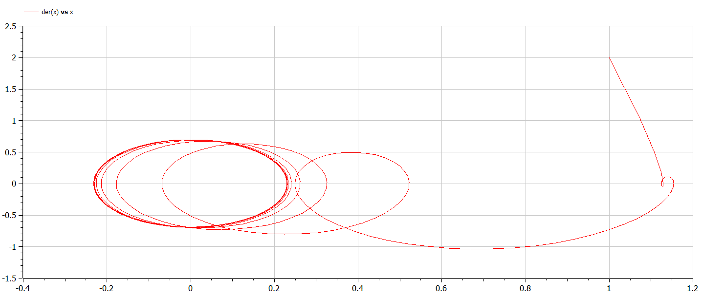

---
# Front matter
title: "Отчёт по лабораторной работе №4"
subtitle: "Модель гармонических колебаний"
author: "Жукова Виктория Юрьевна"

# Generic otions
lang: ru-RU
toc-title: "Содержание"

# Bibliography
bibliography: bib/cite.bib
csl: pandoc/csl/gost-r-7-0-5-2008-numeric.csl
# Formatting
toc-title: "Содержание"
toc: true # Table of contents
toc_depth: 2
lof: true # List of figures
lot: true # List of tables
fontsize: 12pt
linestretch: 1.5
papersize: a4paper
documentclass: scrreprt
polyglossia-lang: russian
polyglossia-otherlangs: english
mainfont: PT Serif
romanfont: PT Serif
sansfont: PT Sans
monofont: PT Mono
mainfontoptions: Ligatures=TeX
romanfontoptions: Ligatures=TeX
sansfontoptions: Ligatures=TeX,Scale=MatchLowercase
monofontoptions: Scale=MatchLowercase
indent: true
pdf-engine: lualatex
header-includes:
  - \usepackage[russian]{babel}
  - \linepenalty=10 # the penalty added to the badness of each line within a paragraph (no associated penalty node) Increasing the value makes tex try to have fewer lines in the paragraph.
  - \interlinepenalty=0 # value of the penalty (node) added after each line of a paragraph.
  - \hyphenpenalty=50 # the penalty for line breaking at an automatically inserted hyphen
  - \exhyphenpenalty=50 # the penalty for line breaking at an explicit hyphen
  - \binoppenalty=700 # the penalty for breaking a line at a binary operator
  - \relpenalty=500 # the penalty for breaking a line at a relation
  - \clubpenalty=150 # extra penalty for breaking after first line of a paragraph
  - \widowpenalty=150 # extra penalty for breaking before last line of a paragraph
  - \displaywidowpenalty=50 # extra penalty for breaking before last line before a display math
  - \brokenpenalty=100 # extra penalty for page breaking after a hyphenated line
  - \predisplaypenalty=10000 # penalty for breaking before a display
  - \postdisplaypenalty=0 # penalty for breaking after a display
  - \floatingpenalty = 20000 # penalty for splitting an insertion (can only be split footnote in standard LaTeX)
  - \raggedbottom # or \flushbottom
  - \usepackage{float} # keep figures where there are in the text
  - \floatplacement{figure}{H} # keep figures where there are in the text
---

# Цель работы
Цель данной работы состоит в том, чтобы рассмотреть модель гармонических колебаний, сделать программу для получения графиков линейного гармонического осциллятора.

# Задание
Постройте фазовый портрет гармонического осциллятора и решение уравнения
гармонического осциллятора для следующих случаев
1. Колебания гармонического осциллятора без затуханий и без действий внешней
силы
$\ddot{x}+12x=0$
2. Колебания гармонического осциллятора c затуханием и без действий внешней
силы
$\ddot{x}+10\dot{x}+5x=0$
3. Колебания гармонического осциллятора c затуханием и под действием внешней
силы
$\ddot{x}+7\dot{x}+7x=7sin(3t)\\$
На интервале $t \in [0; 60] \ (шаг \ 0.05) \ с \ начальными \ условиями \ x_0=1, \ y_0=2$

# Теоретическое введение
Движение грузика на пружинке, маятника, заряда в электрическом контуре, а
также эволюция во времени многих систем в физике, химии, биологии и других
науках при определенных предположениях можно описать одним и тем же
дифференциальным уравнением, которое в теории колебаний выступает в качестве
основной модели. Эта модель называется линейным гармоническим осциллятором.
Уравнение свободных колебаний гармонического осциллятора имеет следующий вид:

$$ \ddot {x} + 2 \gamma \dot {x} + w_0^2x = f(t) $$

$x$ — переменная, описывающая состояние системы (смещение грузика, заряд конденсатора и т.д.)

$t$ — время

$w$ — частота

$\gamma$ — затухание

# Вывод системы уравнений
1. $\ddot{x}+12x=0\\$
Система будет следующего вида: 
$$ \begin{cases} \dot{x} = y \\ \dot{y} = -12x \end{cases} $$
2. $\ddot{x}+10\dot{x}+5x=0\\$
Система будет следующего вида: 
$$ \begin{cases} \dot{x} = y \\ \dot{y} = -10y-5x \end{cases} $$
3. $\ddot{x}+7\dot{x}+7x=7sin(3t)\\$
Система будет следующего вида: 
$$ \begin{cases} \dot{x} = y \\ \dot{y} = -7y-7x+7sin(3t) \end{cases} $$

# Построение
1. колебания гармонического осциллятора без затуханий и без действий внешней
силы. 
Код :
```
model lab4_1

constant Real w=sqrt(12);
  
Real x;
Real y;
  
initial equation
  x=1;
  y=2;

equation
  der(x)=y;
  der(y)=-w*w*x;

end lab4_1;
```
График (рис.1):

*Рис.1. График колебания гармонического осциллятора без затуханий и без действий внешней
силы*

2. Колебания гармонического осциллятора c затуханием и без действий внешней
силы.
Код:
```
model lab4_2
  
constant Real w=sqrt(5);
constant Real g=10;
  
Real x;
Real y;
  
initial equation
  x=1;
  y=2;

equation
  der(x)=y;
  der(y)=-g*y-w*w*x;

end lab4_2;
```
График (рис.2):

*Рис.2. График гармонического осциллятора c затуханием и без действий внешней
силы*

3. Колебания гармонического осциллятора c затуханием и под действием внешней
силы.
Код:
```
model lab4_3
  
constant Real w=sqrt(5);
constant Real g=10;
  
Real x;
Real y;
Real f;
  
initial equation
  x=1;
  y=2;
  f=0;

equation
  f=7*sin(3*time);
  der(x)=y;
  der(y)=-g*y-w*w*x+f;

end lab4_3;
```
График (рис.3):

*Рис.3. График гармонического осциллятора c затуханием и под действием внешней силы*

# Ответы на вопросы
- Запишите простейшую модель гармонических колебаний:
$\\ x = x_m cos (ωt + φ0) $.
- Дайте определение осциллятора:
Cистема, совершающая колебания, то есть показатели которой периодически повторяются во времени.
- Запишите модель математического маятника:
Уравнение динамики принимает вид: $$\frac{d^2 \alpha}{d t^2} + \frac{g}{L} sin{\alpha} = 0$$ В случае малых колебаний полагают $sin{\alpha} ≈ \alpha$. В результате возникает линейное дифференциальное уравнение $$\frac{d^2 \alpha}{d t^2} + \frac{g}{L} \alpha = 0$$ или $$\frac{d^2 \alpha}{d t^2} + \omega^2 \alpha = 0$$
- Запишите алгоритм перехода от дифференциального уравнения второго порядка к двум дифференциальным уравнениям первого порядка:
Пусть у нас есть дифференциальное уравнение 2-го порядка: $$ \ddot {x} + w_0^2x = f(t) $$

Для перехода к системе уравнений первого порядка сделаем замену (это метод Ранге-Кутты): $$ y = \dot{x} $$

Тогда получим систему уравнений: $$ \begin{cases} y = \dot{x} \\ \dot{y} = - w_0^2x \end{cases}$$
- Что такое фазовый портрет и фазовая траектория?
Фазовый портрет — это то, как величины, описывающие состояние системы (= динамические переменные, зависят друг от друга. Фазовая траектория — кривая в фазовом пространстве, составленная из точек, представляющих состояние динамической системы в последовательные моменты времени в течение всего времени эволюции.

# Выводы
1. Изучила модель гармонического осциллятора.
2. Построила фазовый портрет гармонического осциллятора и решила уравнения
гармонического осциллятора для случаев:
- Колебания гармонического осциллятора без затуханий и без действий внешней
силы
- Колебания гармонического осциллятора c затуханием и без действий внешней
силы
- Колебания гармонического осциллятора c затуханием и под действием внешней
силы
3. Научилась строить графики в openModelica с заданным интервалом и шагом.

# Библиография
1. [Методические материалы по гармоническому осциллятору. Кулябов Д.С.](https://esystem.rudn.ru/pluginfile.php/1343809/mod_resource/content/2/%D0%9B%D0%B0%D0%B1%D0%BE%D1%80%D0%B0%D1%82%D0%BE%D1%80%D0%BD%D0%B0%D1%8F%20%D1%80%D0%B0%D0%B1%D0%BE%D1%82%D0%B0%20%E2%84%96%203.pdf)
2. [Операции и значения в функциях Latex](https://dxdy.ru/post1100.html#p1100)