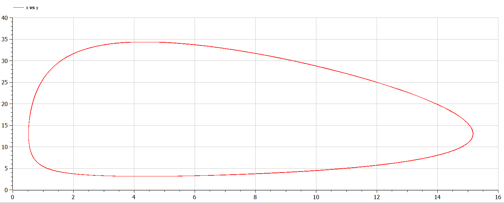
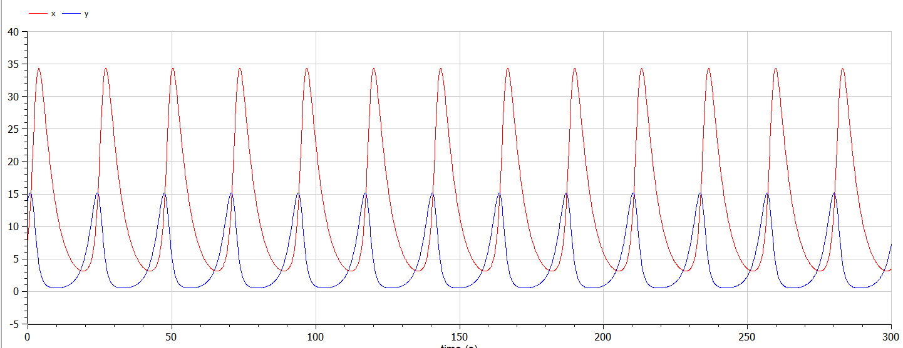

# Модель хищник-жертва

###### ФИО: Жукова Виктория Юрьевна
###### Группа: НКНбд-01-19  
###### Студ. билет: 1032196000

---

# Прагматика
Для моделирования взаимоотношений хищник-жертва

# Цель
Рассмотреть модель Лотки-Вольтерры, сделать программу для получения графиков изменения и зависимости хищников и жертв.

---

# Задача

Для модели «хищник-жертва»:
$$ \begin{cases} \frac{dx}{dt} = -0.23x(t)+0.053x(t)y(t) \\ \frac{dy}{dt} = -0.43y(t)+0.033x(t)y(t) \end{cases} $$
Постройте график зависимости численности хищников от численности жертв,
а также графики изменения численности хищников и численности жертв при
следующих начальных условиях:
$x_0=8, y_0=14$ . Найдите стационарное состояние системы.

---

# Теоретическое введение

Простейшая модель взаимодействия двух видов типа «хищник — жертва» - модель Лотки-Вольтерры. Данная двувидовая модель основывается на следующих предположениях:
1. Численность популяции жертв x и хищников y зависят только от времени
(модель не учитывает пространственное распределение популяции на
занимаемой территории)
2. В отсутствии взаимодействия численность видов изменяется по модели
Мальтуса, при этом число жертв увеличивается, а число хищников падает
3. Естественная смертность жертвы и естественная рождаемость хищника
считаются несущественными
4. Эффект насыщения численности обеих популяций не учитывается
5. Скорость роста численности жертв уменьшается пропорционально
численности хищников

---

# Математическое представление

$$\\ \begin{cases} \frac{dx}{dt} = -ax(t)+bx(t)y(t) \\ \frac{dy}{dt} = -cy(t)+dx(t)y(t) \end{cases} \\$$
$x$ – число жертв, $y$ - число хищников. 
$a$ - скорость естественного прироста числа жертв в отсутствие хищников
$\\с$- естественное вымирание хищников, лишенных пищи в виде жертв

---

# Результаты. Код

```
model lab05

constant Real a=0.23;
constant Real b=0.053;
constant Real c=0.43;
constant Real d=0.033;

Real x;
Real y;

initial equation
x=8;
y=14;

equation
der(x)=-a*x+b*x*y;
der(y)=c*y-d*x*y;

end lab05;
```

---

# Результаты. График зависимости



---

# Результаты. График изменения



---

# Выводы

1. Построила график зависимости численности хищников от численности жертв.
2. Построила график изменения численности хищников от численности жертв.
3. Нашла стационарное состояние системы.
4. Изучила модель Лотки-Вольтерры.
5. Улучшила навыки работы с openModelica.

