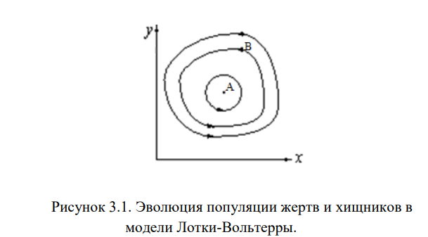
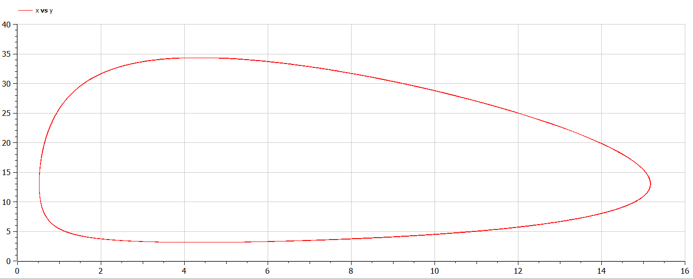
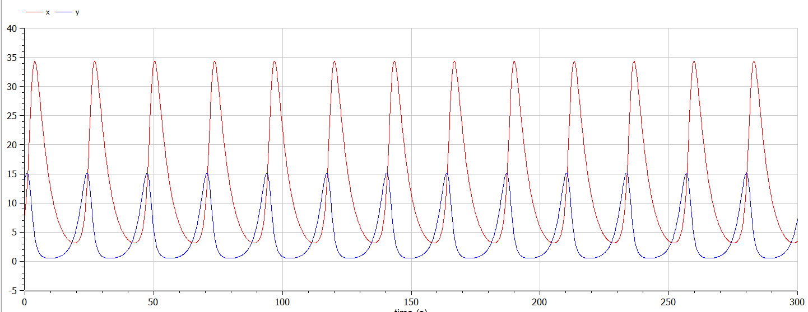

---
# Front matter
title: "Отчёт по лабораторной работе №5"
subtitle: "Модель хищник-жертва"
author: "Жукова Виктория Юрьевна"

# Generic otions
lang: ru-RU
toc-title: "Содержание"

# Bibliography
bibliography: bib/cite.bib
csl: pandoc/csl/gost-r-7-0-5-2008-numeric.csl
# Formatting
toc-title: "Содержание"
toc: true # Table of contents
toc_depth: 2
lof: true # List of figures
lot: true # List of tables
fontsize: 12pt
linestretch: 1.5
papersize: a4paper
documentclass: scrreprt
polyglossia-lang: russian
polyglossia-otherlangs: english
mainfont: PT Serif
romanfont: PT Serif
sansfont: PT Sans
monofont: PT Mono
mainfontoptions: Ligatures=TeX
romanfontoptions: Ligatures=TeX
sansfontoptions: Ligatures=TeX,Scale=MatchLowercase
monofontoptions: Scale=MatchLowercase
indent: true
pdf-engine: lualatex
header-includes:
  - \usepackage[russian]{babel}
  - \linepenalty=10 # the penalty added to the badness of each line within a paragraph (no associated penalty node) Increasing the value makes tex try to have fewer lines in the paragraph.
  - \interlinepenalty=0 # value of the penalty (node) added after each line of a paragraph.
  - \hyphenpenalty=50 # the penalty for line breaking at an automatically inserted hyphen
  - \exhyphenpenalty=50 # the penalty for line breaking at an explicit hyphen
  - \binoppenalty=700 # the penalty for breaking a line at a binary operator
  - \relpenalty=500 # the penalty for breaking a line at a relation
  - \clubpenalty=150 # extra penalty for breaking after first line of a paragraph
  - \widowpenalty=150 # extra penalty for breaking before last line of a paragraph
  - \displaywidowpenalty=50 # extra penalty for breaking before last line before a display math
  - \brokenpenalty=100 # extra penalty for page breaking after a hyphenated line
  - \predisplaypenalty=10000 # penalty for breaking before a display
  - \postdisplaypenalty=0 # penalty for breaking after a display
  - \floatingpenalty = 20000 # penalty for splitting an insertion (can only be split footnote in standard LaTeX)
  - \raggedbottom # or \flushbottom
  - \usepackage{float} # keep figures where there are in the text
  - \floatplacement{figure}{H} # keep figures where there are in the text
---

# Цель работы
Цель данной работы состоит в том, чтобы рассмотреть модель хищник-жертва - модель Лотки-Вольтерры, построить графики зависимости и изменеия и найти стационарное состояние.

# Задание
(Вариант 11)
Для модели «хищник-жертва»:
$$ \begin{cases} \frac{dx}{dt} = -0.23x(t)+0.053x(t)y(t) \\ \frac{dy}{dt} = -0.43y(t)+0.033x(t)y(t) \end{cases} $$
Постройте график зависимости численности хищников от численности жертв,
а также графики изменения численности хищников и численности жертв при
следующих начальных условиях:
$x_0=8, y_0=14$ . Найдите стационарное состояние системы.

# Теоретическое введение
Простейшая модель взаимодействия двух видов типа «хищник — жертва» - модель Лотки-Вольтерры. Данная двувидовая модель основывается на следующих предположениях:
1. Численность популяции жертв x и хищников y зависят только от времени
(модель не учитывает пространственное распределение популяции на
занимаемой территории)
2. В отсутствии взаимодействия численность видов изменяется по модели
Мальтуса, при этом число жертв увеличивается, а число хищников падает
3. Естественная смертность жертвы и естественная рождаемость хищника
считаются несущественными
4. Эффект насыщения численности обеих популяций не учитывается
5. Скорость роста численности жертв уменьшается пропорционально
численности хищников
$$\\ \begin{cases} \frac{dx}{dt} = -ax(t)+bx(t)y(t) \\ \frac{dy}{dt} = -cy(t)+dx(t)y(t) \end{cases} \\$$
В этой модели $x$ – число жертв, $y$ - число хищников. Коэффициент $a$
описывает скорость естественного прироста числа жертв в отсутствие хищников, $\\с$- естественное вымирание хищников, лишенных пищи в виде жертв. Вероятность
взаимодействия жертвы и хищника считается пропорциональной как количеству
жертв, так и числу самих хищников ($xy$). Каждый акт взаимодействия уменьшает популяцию жертв, но способствует увеличению популяции хищников (члены $-bxy$ и $dxy$ в правой части уравнения).


Математический анализ этой (жесткой) модели показывает, что имеется
стационарное состояние (A на рис. 3.1), всякое же другое начальное состояние (B)
приводит к периодическому колебанию численности как жертв, так и хищников,
так что по прошествии некоторого времени система возвращается в состояние B.
*Замечание: жесткую модель всегда надлежит исследовать на структурную
устойчивость полученных при ее изучении результатов по отношению к малым
изменениям модели (делающим ее мягкой).*

# Решение 
1. Программный код
```
model lab05

constant Real a=0.23;
constant Real b=0.053;
constant Real c=0.43;
constant Real d=0.033;

Real x;
Real y;

initial equation
x=8;
y=14;

equation
der(x)=-a*x+b*x*y;
der(y)=c*y-d*x*y;

end lab05;
```

2. График зависимости численности хищников от численности жертв (рис. 3.2)

*Рис. 3.2. График зависимости численности хищников от численности жертв*


3. График изменения численности хищников и численности жертв (рис. 3.3)

*Рис. 3.3. График изменения численности хищников и численности жертв*

4. Стационарное состояние системы

$x_0=\frac{c}{d}=\frac{0.43}{0.033}=13,03030303030303 \\
y_0=\frac{a}{b}=\frac{0.23}{0.053}=4,339622641509434$

# Выводы

1. Построила график зависимости численности хищников от численности жертв.
2. Построила график изменения численности хищников от численности жертв.
3. Нашла стационарное состояние системы.
4. Изучила модель Лотки-Вольтерры.
5. Улучшила навыки работы с openModelica.

# Библиография
1. [Модель хищник-жертва. Кулябов Д.С.](https://esystem.rudn.ru/pluginfile.php/1343813/mod_resource/content/2/%D0%9B%D0%B0%D0%B1%D0%BE%D1%80%D0%B0%D1%82%D0%BE%D1%80%D0%BD%D0%B0%D1%8F%20%D1%80%D0%B0%D0%B1%D0%BE%D1%82%D0%B0%20%E2%84%96%204.pdf)
