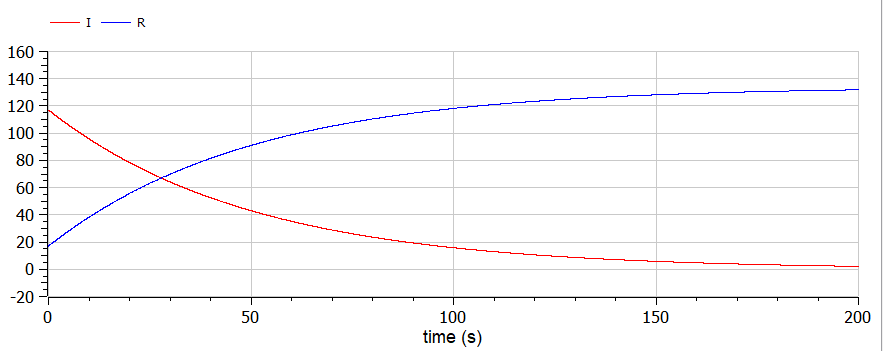
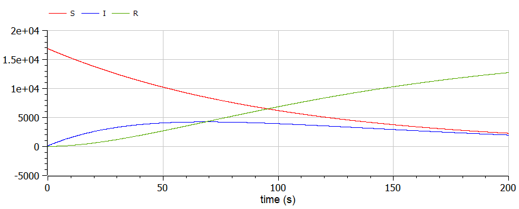

# Задача об эпидемии

###### ФИО: Жукова Виктория Юрьевна
###### Группа: НКНбд-01-19  
###### Студ. билет: 1032196000

---

# Прагматика
Для моделирования хода эпидемии

# Цель
Рассмотреть задачу об эпидемии, сделать программу для получения графиков течения эпидемии

---

# Задача
На одном острове вспыхнула эпидемия. Известно, что из всех проживающих
на острове (N=17 000) в момент начала эпидемии (t=0) число заболевших людей
(являющихся распространителями инфекции) $I(0)=117$, А число здоровых людей с иммунитетом к болезни $R(0)=17$. Таким образом, число людей восприимчивых к болезни, но пока здоровых, в начальный момент времени $S(0)=N-I(0)-R(0)$.
Постройте графики изменения числа особей в каждой из трех групп.
Рассмотрите, как будет протекать эпидемия в случае:
1) если $I(0) \leq I^*$
2) если $I(0) > I^*$

---

# Теоретическое введение
Будем считать, что если число заболевших не превышает критического значения $I^*$, то все больные изолированы и не заражают здоровых. Когда $I(0) > I^*$, тогда инфицирование способны заражать восприимчивых к болезни особей.

---

# Результаты. Случай $I(0) \leq I^*$. Код
```
model lab6_1
constant Real a=0.01;
constant Real b=0.02;
constant Real N=17000;

Real I;
Real R;
Real S;

initial equation
I=117;
R=17;
S=16866;

equation
der(S)=0;
der(I)=-b*I;
der(R)=b*I;

end lab6_1;
```

---
# Результаты. Случай $I(0) \leq I^*$. График


---

# Результаты. Случай $I(0) > I^*$. Код
```
model lab6_2
constant Real a=0.01;
constant Real b=0.02;
constant Real N=17000;

Real I;
Real R;
Real S;

initial equation
I=117;
R=17;
S=16866;

equation
der(S)=-a*S;
der(I)=a*S-b*I;
der(R)=b*I;

end lab6_2;
```
---
# Результаты. Случай $I(0) > I^*$. График


---
# Выводы
1. В первом случае с течением времени количество выздоровливающих и приобретающих иммунитет особей растет, а количество болеющих распространителей уменьшается.
2. Во втором случае, восприимчивые к болезни, но пока здоровые особи уменьшаются на протяжении всей эпидемии, количество заболевших и заразных особей увелчивается в первой трети эксперемента и затем медленно уменьшается, а количество людей с иммунитетом постоянно растет.
3. Рассмотрела задачу об эпидемии.
4. Построила графики и проанализировала результаты.

