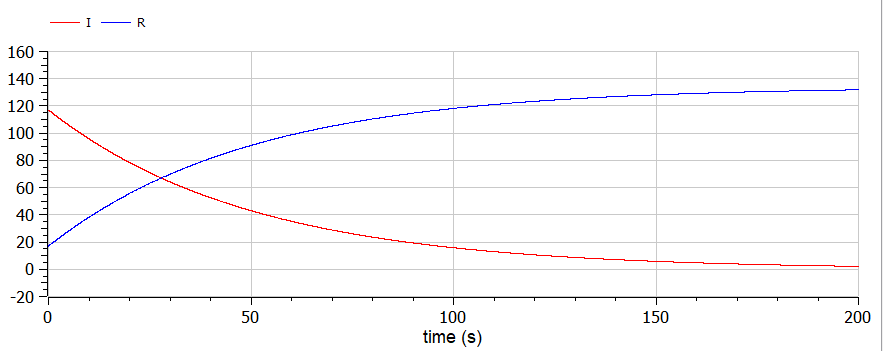
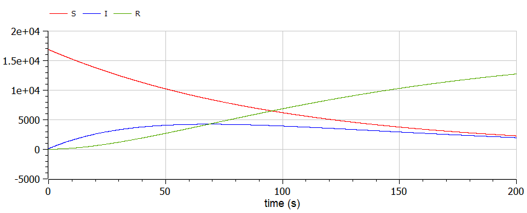

---
# Front matter
title: "Отчёт по лабораторной работе №6"
subtitle: "Задача об эпидемии"
author: "Жукова Виктория Юрьевна"

# Generic otions
lang: ru-RU
toc-title: "Содержание"

# Bibliography
bibliography: bib/cite.bib
csl: pandoc/csl/gost-r-7-0-5-2008-numeric.csl
# Formatting
toc-title: "Содержание"
toc: true # Table of contents
toc_depth: 2
lof: true # List of figures
lot: true # List of tables
fontsize: 12pt
linestretch: 1.5
papersize: a4paper
documentclass: scrreprt
polyglossia-lang: russian
polyglossia-otherlangs: english
mainfont: PT Serif
romanfont: PT Serif
sansfont: PT Sans
monofont: PT Mono
mainfontoptions: Ligatures=TeX
romanfontoptions: Ligatures=TeX
sansfontoptions: Ligatures=TeX,Scale=MatchLowercase
monofontoptions: Scale=MatchLowercase
indent: true
pdf-engine: lualatex
header-includes:
  - \usepackage[russian]{babel}
  - \linepenalty=10 # the penalty added to the badness of each line within a paragraph (no associated penalty node) Increasing the value makes tex try to have fewer lines in the paragraph.
  - \interlinepenalty=0 # value of the penalty (node) added after each line of a paragraph.
  - \hyphenpenalty=50 # the penalty for line breaking at an automatically inserted hyphen
  - \exhyphenpenalty=50 # the penalty for line breaking at an explicit hyphen
  - \binoppenalty=700 # the penalty for breaking a line at a binary operator
  - \relpenalty=500 # the penalty for breaking a line at a relation
  - \clubpenalty=150 # extra penalty for breaking after first line of a paragraph
  - \widowpenalty=150 # extra penalty for breaking before last line of a paragraph
  - \displaywidowpenalty=50 # extra penalty for breaking before last line before a display math
  - \brokenpenalty=100 # extra penalty for page breaking after a hyphenated line
  - \predisplaypenalty=10000 # penalty for breaking before a display
  - \postdisplaypenalty=0 # penalty for breaking after a display
  - \floatingpenalty = 20000 # penalty for splitting an insertion (can only be split footnote in standard LaTeX)
  - \raggedbottom # or \flushbottom
  - \usepackage{float} # keep figures where there are in the text
  - \floatplacement{figure}{H} # keep figures where there are in the text
---

# Цель работы
Цель данной работы состоит в том, чтобы рассмотреть задачу об эпидемии, сделать программу для получения графиков течения эпидемии.

# Задание
(Вариант 11)

На одном острове вспыхнула эпидемия. Известно, что из всех проживающих
на острове (N=17 000) в момент начала эпидемии (t=0) число заболевших людей
(являющихся распространителями инфекции) I(0)=117, А число здоровых людей с
иммунитетом к болезни R(0)=17. Таким образом, число людей восприимчивых к
болезни, но пока здоровых, в начальный момент времени S(0)=N-I(0)-R(0).
Постройте графики изменения числа особей в каждой из трех групп.
Рассмотрите, как будет протекать эпидемия в случае:
1) если $I(0) \leq I^*$
2) если $I(0) > I^*$

# Теоретическое введение
Рассмотрим простейшую модель эпидемии. Предположим, что некая популяция, состоящая из $N$ особей, (считаем, что популяция изолирована) подразделяется на три группы. Первая группа - это восприимчивые к болезни, но
пока здоровые особи, обозначим их через $S(t)$. Вторая группа – это число
инфицированных особей, которые также при этом являются распространителями
инфекции, обозначим их $I(t)$. А третья группа, обозначающаяся через $R(t)$ – это
здоровые особи с иммунитетом к болезни.

До того, как число заболевших не превышает критического значения $I^*$, считаем, что все больные изолированы и не заражают здоровых. Когда $I(0) > I^*$,
тогда инфицирование способны заражать восприимчивых к болезни особей.

Таким образом, скорость изменения числа *S(t)* меняется по следующему закону:

$ \frac{dS}{dt} = \begin{cases} -\alpha S, \ если \ I(0)>I^* \\ 0, \ если \ I(0) \leq I^* \end{cases} \\$

Поскольку каждая восприимчивая к болезни особь, которая, в конце концов,
заболевает, сама становится инфекционной, то скорость изменения числа
инфекционных особей представляет разность за единицу времени между
заразившимися и теми, кто уже болеет и лечится, т.е.:

$ \frac{dS}{dt} = \begin{cases} -\alpha S-\beta I, \ если \ I(0)>I^* \\ -\beta I, \ если \ I(0) \leq I^* \end{cases} \\$

А скорость изменения выздоравливающих особей (при этом приобретающих
иммунитет к болезни)

$\frac{dR}{dt}=\beta I$

Постоянные пропорциональности
$\alpha , \beta$, - это коэффициенты заболеваемости
и выздоровления соответственно.

Для того, чтобы решения соответствующих уравнений определялось
однозначно, необходимо задать начальные условия.Считаем, что на начало
эпидемии в момент времени
$t=0$ нет особей с иммунитетом к болезни $R(0)=0$, а
число инфицированных и восприимчивых к болезни особей
$I(0)$ и
$S(0)$
соответственно. Для анализа картины протекания эпидемии необходимо
рассмотреть два случая: $I(0) \leq I^*$ и $I(0) > I^*$

# Реализация
1. Для случая $I(0) \leq I^*$
- Код программы
```
model lab6_1
constant Real a=0.01;
constant Real b=0.02;
constant Real N=17000;

Real I;
Real R;
Real S;

initial equation
I=117;
R=17;
S=16866;

equation
der(S)=0;
der(I)=-b*I;
der(R)=b*I;

end lab6_1;
```

- График (рис. 1)


*Рис. 2. График для случая 1*

2. Для случая $I(0) > I^*$
- Код программы
```
model lab6_2
constant Real a=0.01;
constant Real b=0.02;
constant Real N=17000;

Real I;
Real R;
Real S;

initial equation
I=117;
R=17;
S=16866;

equation
der(S)=-a*S;
der(I)=a*S-b*I;
der(R)=b*I;

end lab6_2;
```

- График (рис. 1)


*Рис. 2. График для случая 2*

# Выводы
1. В первом случае с течением времени количество выздоровливающих и приобретающих иммунитет особей растет, а количество болеющих распространителей уменьшается.
2. Во втором случае, восприимчивые к болезни, но пока здоровые особи уменьшаются на протяжении всей эпидемии, количество заболевших и заразных особей увелчивается в первой трети эксперемента и затем медленно уменьшается, а количество людей с иммунитетом постоянно растет.
3. Рассмотрела задачу об эпидемии.
4. Построила графики и проанализировала результаты.

# Библиография
[Методические материалы по задаче об эпидемии. Кулябов Д.С.](https://esystem.rudn.ru/pluginfile.php/1343817/mod_resource/content/2/%D0%9B%D0%B0%D0%B1%D0%BE%D1%80%D0%B0%D1%82%D0%BE%D1%80%D0%BD%D0%B0%D1%8F%20%D1%80%D0%B0%D0%B1%D0%BE%D1%82%D0%B0%20%E2%84%96%205.pdf)