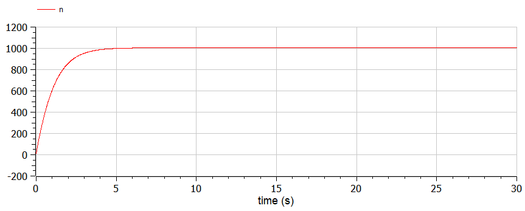
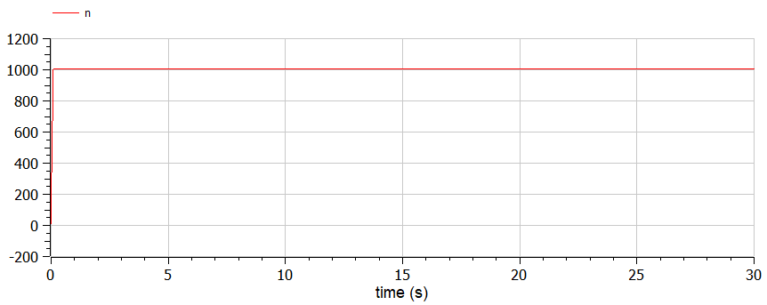
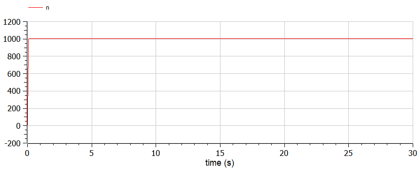

# Эффективность рекламы

###### ФИО: Жукова Виктория Юрьевна
###### Группа: НКНбд-01-19  
###### Студ. билет: 1032196000

---

# Прагматика
Для моделирования хода рекламной компании

# Цель
Рассмотреть модель рекламной компании, определить ее эффективность с помощью графиков.

---

# Задача
Постройте график распространения рекламы, математическая модель которой описывается
следующим уравнением:

1. $\frac{dn}{dt} = (0.84+0.00022n(t))(N-n(t))$

2. $\frac{dn}{dt} = (0.000022+0.74n(t))(N-n(t))$

3. $\frac{dn}{dt} = (0.74sin(t)+0.35cos(t)n(t))(N-n(t))$

При этом объем аудитории $N=1005$, в начальный момент о товаре знает 11 человек. Для
случая 2 определите в какой момент времени скорость распространения рекламы будет иметь максимальное значение.

---

# Теоретическое введение
Организуется рекламная кампания нового товара или услуги. Необходимо,
чтобы прибыль будущих продаж с избытком покрывала издержки на рекламу.
Вначале расходы могут превышать прибыль, поскольку лишь малая часть
потенциальных покупателей будет информирована о новинке. Затем, при
увеличении числа продаж, возрастает и прибыль, и, наконец, наступит момент,
когда рынок насытиться, и рекламировать товар станет бесполезным.
Предположим, что торговыми учреждениями реализуется некоторая

---

# Теоретическое введение
продукция, о которой в момент времени $t$ из числа потенциальных покупателей
$N$ знает лишь $n$ покупателей. Для ускорения сбыта продукции запускается реклама
по радио, телевидению и других средств массовой информации. После запуска
рекламной кампании информация о продукции начнет распространяться среди
потенциальных покупателей путем общения друг с другом. Таким образом, после
запуска рекламных объявлений скорость изменения числа знающих о продукции
людей пропорциональна как числу знающих о товаре покупателей, так и числу
покупателей о нем не знающих.

---

# Теоретическое введение
$\alpha_1(t)>0$ - характеризует интенсивность рекламной кампании (зависит от затрат на рекламу в данный момент времени), 
а $\alpha_2(t)$ - это коэффициент отображающий сарафанное радио.

---

# Случай 1. Код
```
model lab07_1

constant Real N=1005;
constant Real a1=0.84;
constant Real a2=0.00022;

Real n;

initial equation
n=11;

equation
der(n)=(a1+a2*n)*(N-n);

end lab07_1;
```
---

# Случай 1. График


---

# Случай 2. Код
```
model lab07_2

constant Real N=1005;
constant Real a1=0.000022;
constant Real a2=0.74;

Real n;

initial equation
n=11;

equation
der(n)=(a1+a2*n)*(N-n);

end lab07_2;
```
---

# Случай 2. График


---

# Случай 3. Код
```
model lab07_3

constant Real N=1005;

Real a1;
Real a2;
Real n;

initial equation
n=11;

equation
a1=0.74*sin(time);
a2=0.35*cos(time);
der(n)=(a1+a2*n)*(N-n);

end lab07_3;
```
---

# Случай 3. График


---

# Выводы
1. Рассмотрела математическую модель рекламной компании.
2. Построила графики распространения рекламы.
3. Для случая 2 определила в какой момент времени скорость распространения рекламы 
будет иметь максимальное значение.
