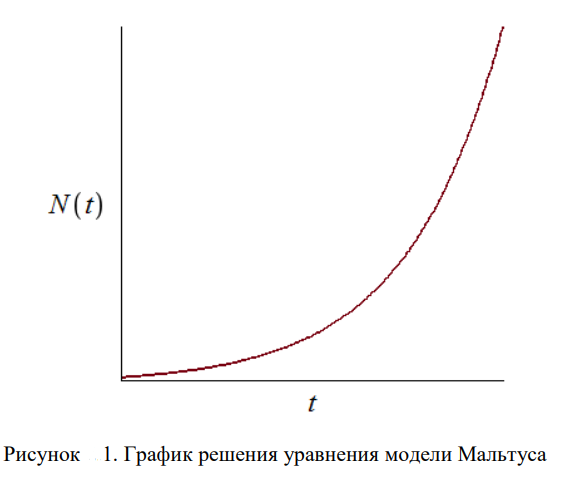
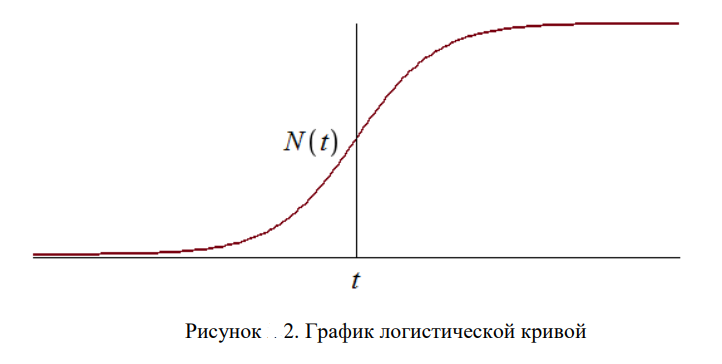
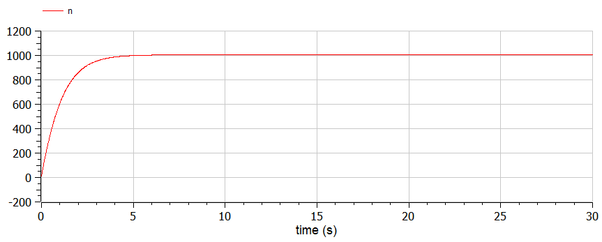
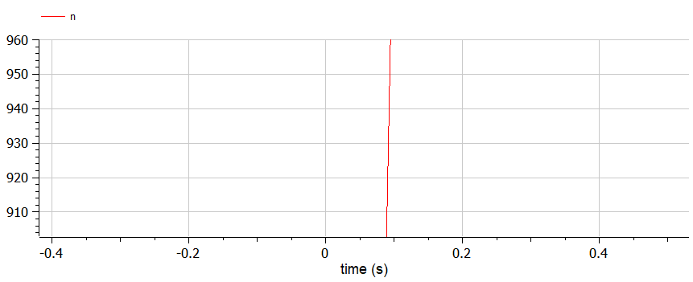

---
# Front matter
title: "Отчёт по лабораторной работе №7"
subtitle: "Эффективность рекламы"
author: "Жукова Виктория Юрьевна"

# Generic otions
lang: ru-RU
toc-title: "Содержание"

# Bibliography
bibliography: bib/cite.bib
csl: pandoc/csl/gost-r-7-0-5-2008-numeric.csl
# Formatting
toc-title: "Содержание"
toc: true # Table of contents
toc_depth: 2
lof: true # List of figures
lot: true # List of tables
fontsize: 12pt
linestretch: 1.5
papersize: a4paper
documentclass: scrreprt
polyglossia-lang: russian
polyglossia-otherlangs: english
mainfont: PT Serif
romanfont: PT Serif
sansfont: PT Sans
monofont: PT Mono
mainfontoptions: Ligatures=TeX
romanfontoptions: Ligatures=TeX
sansfontoptions: Ligatures=TeX,Scale=MatchLowercase
monofontoptions: Scale=MatchLowercase
indent: true
pdf-engine: lualatex
header-includes:
  - \usepackage[russian]{babel}
  - \linepenalty=10 # the penalty added to the badness of each line within a paragraph (no associated penalty node) Increasing the value makes tex try to have fewer lines in the paragraph.
  - \interlinepenalty=0 # value of the penalty (node) added after each line of a paragraph.
  - \hyphenpenalty=50 # the penalty for line breaking at an automatically inserted hyphen
  - \exhyphenpenalty=50 # the penalty for line breaking at an explicit hyphen
  - \binoppenalty=700 # the penalty for breaking a line at a binary operator
  - \relpenalty=500 # the penalty for breaking a line at a relation
  - \clubpenalty=150 # extra penalty for breaking after first line of a paragraph
  - \widowpenalty=150 # extra penalty for breaking before last line of a paragraph
  - \displaywidowpenalty=50 # extra penalty for breaking before last line before a display math
  - \brokenpenalty=100 # extra penalty for page breaking after a hyphenated line
  - \predisplaypenalty=10000 # penalty for breaking before a display
  - \postdisplaypenalty=0 # penalty for breaking after a display
  - \floatingpenalty = 20000 # penalty for splitting an insertion (can only be split footnote in standard LaTeX)
  - \raggedbottom # or \flushbottom
  - \usepackage{float} # keep figures where there are in the text
  - \floatplacement{figure}{H} # keep figures where there are in the text
---

# Цель работы
Цель данной работы состоит в том, чтобы рассмотреть модель рекламной компании, определить ее эффективность с помощью графиков.

# Задание
(Вариант 11)

Постройте график распространения рекламы, математическая модель которой описывается
следующим уравнением:

1. $\frac{dn}{dt} = (0.84+0.00022n(t))(N-n(t))$

2. $\frac{dn}{dt} = (0.000022+0.74n(t))(N-n(t))$

3. $\frac{dn}{dt} = (0.74sin(t)+0.35cos(t)n(t))(N-n(t))$

При этом объем аудитории $N=1005$, в начальный момент о товаре знает 11 человек. Для
случая 2 определите в какой момент времени скорость распространения рекламы будет иметь максимальное значение.

# Теоретическое введение
Организуется рекламная кампания нового товара или услуги. Необходимо,
чтобы прибыль будущих продаж с избытком покрывала издержки на рекламу.
Вначале расходы могут превышать прибыль, поскольку лишь малая часть
потенциальных покупателей будет информирована о новинке. Затем, при
увеличении числа продаж, возрастает и прибыль, и, наконец, наступит момент,
когда рынок насытиться, и рекламировать товар станет бесполезным.

Предположим, что торговыми учреждениями реализуется некоторая
продукция, о которой в момент времени $t$ из числа потенциальных покупателей
$N$ знает лишь $n$ покупателей. Для ускорения сбыта продукции запускается реклама
по радио, телевидению и других средств массовой информации. После запуска
рекламной кампании информация о продукции начнет распространяться среди
потенциальных покупателей путем общения друг с другом. Таким образом, после
запуска рекламных объявлений скорость изменения числа знающих о продукции
людей пропорциональна как числу знающих о товаре покупателей, так и числу
покупателей о нем не знающих.

Модель рекламной кампании описывается следующими величинами.
Считаем, что
$\frac{dn}{dt}$ - скорость изменения со временем числа потребителей, узнавших о товаре и готовых его купить,
$t$ - время, прошедшее с начала рекламной кампании,
$n(t)$ - число уже информированных клиентов. Эта величина пропорциональна числу покупателей, еще не знающих о нем, это описывается следующим образом:
$\alpha_1(t)(N-n(t))$, где
$N$ - общее число потенциальных
платежеспособных покупателей,
$\alpha_1(t)>0$ - характеризует интенсивность рекламной кампании (зависит от затрат на рекламу в данный момент времени).

Помимо этого, узнавшие о товаре потребители также распространяют полученную информацию среди потенциальных покупателей, не знающих о нем (в этом случае
работает т.н. сарафанное радио). Этот вклад в рекламу описывается величиной
$\alpha_2(t)(N-n(t))$, эта величина увеличивается с увеличением потребителей узнавших о товаре. Математическая модель распространения рекламы описывается
уравнением:
$\frac{dn}{dt} = (\alpha_1(t)+\alpha_2(t)n(t)(N-n(t)))$
При
$\alpha_1(t)>>\alpha_2(t)$ получается модель типа модели Мальтуса, решение которой
имеет вид (рис. 1)



В обратном случае, при
$\alpha_1(t)<<\alpha_2(t)$
получаем уравнение логистической
кривой (рис. 2):



# Реализация
1. Случай с $\alpha_1(t)>>\alpha_2(t)$
- Код

```
model lab07_1

constant Real N=1005;
constant Real a1=0.84;
constant Real a2=0.00022;

Real n;

initial equation
n=11;

equation
der(n)=(a1+a2*n)*(N-n);

end lab07_1;
```

- График



*Рисунок 3. График распространения информации о товаре с учетом платной рекламы и с учетом сарафанного радио Коэффициент 𝛼1 = 0.84, коэффициент 𝛼2 = 0.00022*

2. Случай с $\alpha_1(t)<<\alpha_2(t)$
- Код

```
model lab07_2

constant Real N=1005;
constant Real a1=0.000022;
constant Real a2=0.74;

Real n;

initial equation
n=11;

equation
der(n)=(a1+a2*n)*(N-n);

end lab07_2;
```

- График


*Рисунок 4. График распространения информации о товаре с учетом платной
рекламы и с учетом сарафанного радио. Коэффициент 𝛼1 = 0.000022, коэффициент
𝛼2 = 0.74*

- Максимальная скорость распространения рекламы
В связи с тем, что коэффициент $\alpha_2$ в этом случае больше, чем коэффициент $\alpha_1$, то распространение идет в большей степени за счёт сарафанного радио. Соответственно, чем больше людей узнает о продукте, тем быстрее скорость распространения. На графике видно, что количество растет в наибольшей степени в первый момент времени (рис. 5). 



*Рисунок 5. Максимальная скорость*

3. Случай с $\alpha_1(t) \approx \alpha_2(t)$
- Код

```
model lab07_3

constant Real N=1005;

Real a1;
Real a2;
Real n;

initial equation
n=11;

equation
a1=0.74*sin(time);
a2=0.35*cos(time);
der(n)=(a1+a2*n)*(N-n);

end lab07_3;
```

- График

, коэффициент
𝛼2 = 0.35*cos(t)")

*Рисунок 6. График распространения информации о товаре с учетом платной
рекламы и с учетом сарафанного радио. Коэффициент 𝛼1 = 0.74*sin(t), коэффициент
𝛼2 = 0.35*cos(t)*

# Вопросы
1. Записать модель Мальтуса (дать пояснение, где используется данная модель)

dN/dt=aN
Модель Мальтуса используется в экологии для моделирования динамики роста популяции.

2. Записать уравнение логистической кривой (дать пояснение, что описывает
данное уравнение)


Используется для изучении изменений численности населения.

3. На что влияет коэффициент $\alpha_1(t) \ и \ \alpha_2(t)$
в модели распространения рекламы

$\alpha_1(t)>0$ - характеризует интенсивность рекламной кампании (зависит от затрат на рекламу в данный момент времени), 
а $\alpha_2(t)$ - это коэффициент отображающий сарафанное радио.

4. Как ведет себя рассматриваемая модель при $\alpha_1(t)>>\alpha_2(t)$

При
$\alpha_1(t)>>\alpha_2(t)$ получается модель типа модели Мальтуса, решение которой
имеет вид (рис. 1)


5. Как ведет себя рассматриваемая модель при $\alpha_1(t)<<\alpha_2(t)$

при
$\alpha_1(t)<<\alpha_2(t)$
получаем уравнение логистической
кривой (рис. 2):


# Выводы
1. Рассмотрела математическую модель рекламной компании.
2. Построила графики распространения рекламы.
3. Для случая 2 определила в какой момент времени скорость распространения рекламы 
будет иметь максимальное значение.

# Библиография
1. [Методические материалы по эффективности рекламы. Кулябов Д.С.](https://esystem.rudn.ru/pluginfile.php/1343821/mod_resource/content/2/%D0%9B%D0%B0%D0%B1%D0%BE%D1%80%D0%B0%D1%82%D0%BE%D1%80%D0%BD%D0%B0%D1%8F%20%D1%80%D0%B0%D0%B1%D0%BE%D1%82%D0%B0%20%E2%84%96%206.pdf)
2. [Математические модели в экологии. Семериков С. А., Завизена Н. С.](https://core.ac.uk/download/pdf/77240957.pdf)