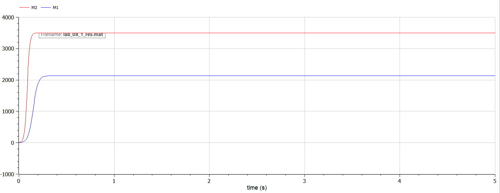
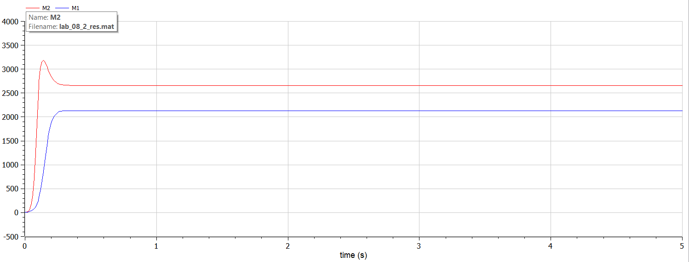

# Модель конкуренции двух фирм

###### ФИО: Жукова Виктория Юрьевна
###### Группа: НКНбд-01-19  
###### Студ. билет: 1032196000

---

# Прагматика
Для моделирования конкуренции двух фирм

# Цель
Рассмотреть модель конкуренции двух фирм и построить графики изменения оборотных средств фирм.

---

# Задача. Случай 1
Рассмотрим две фирмы, производящие взаимозаменяемые товары
одинакового качества и находящиеся в одной рыночной нише. Считаем, что в рамках нашей модели конкурентная борьба ведётся только рыночными методами. То есть, конкуренты могут влиять на противника путем изменения параметров своего производства: себестоимость, время цикла, но не могут прямо вмешиваться в ситуацию на рынке («назначать» цену или влиять на потребителей каким-либо иным способом.) Будем считать, что постоянные издержки пренебрежимо малы, и в модели учитывать не будем. В этом случае динамика изменения объемов продаж фирмы 1 и фирмы 2 описывается следующей системой уравнений:

---
# Задача. Случай 1
$$ \begin{cases} \frac{\partial M_1}{\partial \theta} = M_1 - \frac{b}{c_1} M_1 M_2 - \frac{a_1}{c_1} M_1^2 \\ \frac{\partial M_2}{\partial \theta} = \frac{c_2}{c_1} M_2 -\frac{b}{c_1} M_1 M_2 - \frac{a_2}{c_1} M_2^2 \end{cases} $$


Также введена нормировка $t=c_1\theta$.

---
# Задача. Случай 2
Рассмотрим модель, когда, помимо экономического фактора
влияния (изменение себестоимости, производственного цикла, использование
кредита и т.п.), используются еще и социально-психологические факторы –
формирование общественного предпочтения одного товара другому, не зависимо от их качества и цены. В этом случае взаимодействие двух фирм будет зависеть друг
от друга, соответственно коэффициент перед $M_1M_2$
будет отличаться. Пусть в рамках рассматриваемой модели динамика изменения объемов продаж фирмы 1 и
фирмы 2 описывается следующей системой уравнений:

$$ \begin{cases} \frac{\partial M_1}{\partial \theta} = M_1 - \frac{b}{c_1} M_1 M_2 - \frac{a_1}{c_1} M_1^2 \\ \frac{\partial M_2}{\partial \theta} = \frac{c_2}{c_1} M_2 - (\frac{b}{c_1} + 0.00021)M_1 M_2 - \frac{a_2}{c_1} M_2^2 \end{cases} $$

---
# Задача. Начальные значения
Для обоих случаев рассмотрим задачу со следующими начальными условиями и
параметрами:

$M_0^1 = 5$ — оборотные средства фирмы 1

$M_0^2 = 4.5$ — оборотные средства фирмы 2

$p_{cr} = 12$ — критическая стоимость продукта

$N = 40$ — число потребителей производимого продукта

$q = 1$ — максимальная потребность одного человека в продукте в единицу времени

---
# Задача
$\tau_1 = 20$ — длительность производственного цикла фирмы 1

$\tau_2 = 30$ — длительность производственного цикла фирмы 2

$\tilde{p}_1 = 8$ — себестоимость продукта у фирмы 1

$\tilde{p}_2 = 5$ — себестоимость продукта у фирмы 2

1. Постройте графики изменения оборотных средств фирмы 1 и фирмы 2 без
учета постоянных издержек и с веденной нормировкой для случая 1.
2. Постройте графики изменения оборотных средств фирмы 1 и фирмы 2 без
учета постоянных издержек и с веденной нормировкой для случая 2.

---
# Решение случая 1. Код
```
model lab_08_1
constant Real p_cr = 12 "критическая стоимость продукта";
constant Real N = 40 "число потребителей производимого продукта";
constant Real q = 1 "максимальная потребность одного человека в продукте в единицу времени";
constant Real tau_1 = 20 "длительность производственного цикла фирмы 1";
constant Real tau_2 = 30 "длительность производственного цикла фирмы 2"; 
constant Real p_tilda_1 = 8 "себестоимость продукта, то есть переменные издержки на производство единицы продукции фирмы 1";
constant Real p_tilda_2 = 5 "себестоимость продукта, то есть переменные издержки на производство единицы продукции фирмы 2";
constant Real a1 = p_cr/((tau_1^2)*(p_tilda_1^2)*N*q);
constant Real a2 = p_cr/((tau_2^2)*(p_tilda_2^2)*N*q);
constant Real b = p_cr/((tau_1^2)*(p_tilda_1^2)*(tau_2^2)*(p_tilda_2^2)*N*q);
constant Real c1 = (p_cr-p_tilda_1)/(tau_1*p_tilda_1);
constant Real c2 = (p_cr-p_tilda_2)/(tau_2*p_tilda_2);

Real M1 "оборотные средства предприятия 1";
Real M2 "оборотные средства предприятия 2";
Real teta "безразмерное время";
Real stationary_1 "стационарное состояние фирмы 1";
Real stationary_2 "стационарное состояние фирмы 2";

initial equation
M1 = 5;
M2 = 4.5;
teta = 0;

equation
stationary_1 = (c1*a2-b*c2)/(a1*a2-b*b);
stationary_2 = (a1*c2-b*c1)/(a1*a2-b*b);
teta = time/c1;
der(M1)/der(teta)=M1-(b/c1)*M1*M2-(a1/c1)*M1^2;
der(M2)/der(teta)=(c2/c1)*M2-(b/c1)*M1*M2-(a2/c1)*M2^2;

end lab_08_1;
```

---
# Решение случая 1. График


---
# Решение случая 2. Код
```
model lab_08_2
constant Real p_cr = 12 "критическая стоимость продукта";
constant Real N = 40 "число потребителей производимого продукта";
constant Real q = 1 "максимальная потребность одного человека в продукте в единицу времени";
constant Real tau_1 = 20 "длительность производственного цикла фирмы 1";
constant Real tau_2 = 30 "длительность производственного цикла фирмы 2"; 
constant Real p_tilda_1 = 8 "себестоимость продукта, то есть переменные издержки на производство единицы продукции фирмы 1";
constant Real p_tilda_2 = 5 "себестоимость продукта, то есть переменные издержки на производство единицы продукции фирмы 2";
constant Real a1 = p_cr/((tau_1^2)*(p_tilda_1^2)*N*q);
constant Real a2 = p_cr/((tau_2^2)*(p_tilda_2^2)*N*q);
constant Real b = p_cr/((tau_1^2)*(p_tilda_1^2)*(tau_2^2)*(p_tilda_2^2)*N*q);
constant Real c1 = (p_cr-p_tilda_1)/(tau_1*p_tilda_1);
constant Real c2 = (p_cr-p_tilda_2)/(tau_2*p_tilda_2);

Real M1 "оборотные средства предприятия 1";
Real M2 "оборотные средства предприятия 2";
Real teta "безразмерное время";

initial equation
M1 = 5;
M2 = 4.5;
teta = 0;

equation
teta = time/c1;
der(M1)/der(teta)=M1-(b/c1)*M1*M2-(a1/c1)*M1^2;
der(M2)/der(teta)=(c2/c1)*M2-(b/c1+0.00021)*M1*M2-(a2/c1)*M2^2;

end lab_08_2;
```

---
# Решение случая 2. График


---
# Выводы
Рассмотрела  модель конкуренции двух фирм и построила графики изменения оборотных средств фирм.
